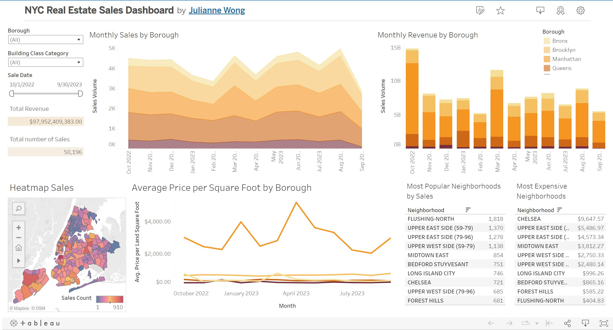

# Introduction 

This data visualization project looks into New York real estate data from October 2022 to September 2023. This data was obtained from the New York City government at 
[this link](https://www.nyc.gov/site/finance/taxes/property-rolling-sales-data.page). The link also provides the glossary of terms in the dataset for further context.

The data was first combined and cleaned through Python then it was uploaded to Tableau for visualization. 
Some considerations made when cleaning the data were i) the removal of sales with zero revenue as these are not real sales but merely transfers and 
ii)the filling of missing values. 
The resulting dashboard is an interactive tool to track the real estate sales and revenue for New York over different time frames and in different boroughs.

A preview of the dashboard can be seen below:

